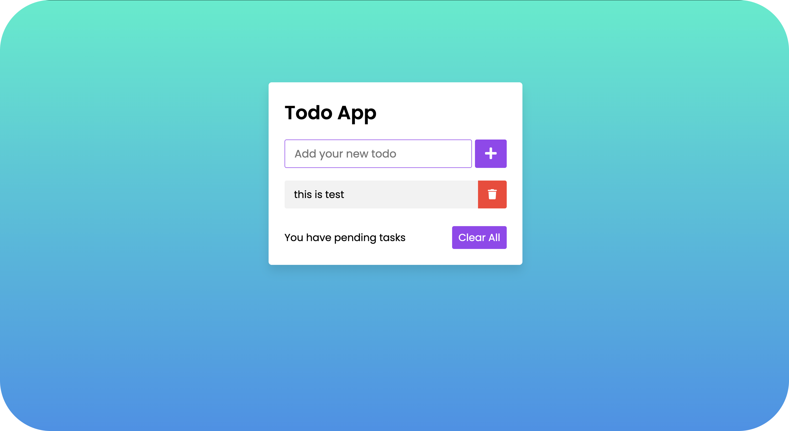

<h1 align="center">Todo List</h1> 
<p align="center"> Simple Todo List UI built with HTML, Tailwind CSS, and JavaScript.</p>

<br/> <br/> 

## Live Demo
[Open the Live Website](#) 

<br/>

Description
The goal was to explore web development hands-on and practice building a simple todo list app. This project was built to practice Tailwind CSS and improve frontend development skills.

 <br/>

Features

- Simple task management system
- Responsive design
- Mobile view support
- Add, complete, and delete tasks
- Automatic dark mode based on the user's system preference
- Clean and minimal UI

<br/>

## Screenshots
###### Desktop



<br/> <br/>

## Tech Stack
- HTML
- Tailwind CSS 
- JavaScript 

<br/>

## Installation & Usage

###### Requirements 
- A modern web browser 
- No build tools required

###### Installation Steps 

1. Clone the project 
```bash
git git clone https://github.com/username/todo-list.git 
```

2. Move into the project directory 
```bash
bash cd todo-list 
```

###### Usage 
Steps Open the project in your browser 

```bash
open index.html 
```

<br/> 

## Project Goals
- Practice building UI with Tailwind CSS 
- Improve frontend development skills 
- Learn DOM manipulation with vanilla JavaScript 

<br/> 

## TODO (Next Steps)
- [ ] Add local storage support
- [ ] Add task categories or tags 
- [ ] Add unit testing (using Vitest or Jest)

<br/>

## Author

 **Kaveh Khorshidi** 

[](https://github.com/username)

[](mailto:youremail@gmail.com)